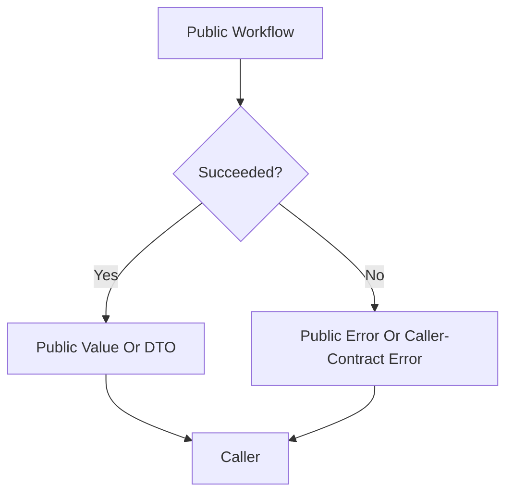

# Public Boundary And Errors

## Overview

This document describes what callers should receive from [[[ project_title_lower ]]]
at the terminal public boundary: stable public values on success or clear public
errors on package-specific failure.

Question this diagram answers: What may leave the package boundary?

## Main Model

### Public Output Boundary

- The baseline exposes `__version__`, public config lifecycle names,
  and public error types.
- Future behavior should return public DTOs, values, or vocabulary types instead
  of raw private runtime objects.
- Raw defaults are not top-level exports by default; public config and facade
  objects should carry caller-facing meaning.

### Public Error Boundary

- `[[[ error_class_name ]]]` is the package-specific public error base.
- `InvalidConfigValueError` is the public config-invariant failure.
- Direct caller-contract mistakes may use built-in `TypeError` or `ValueError`
  when that is clearer than a package-specific runtime failure.
- Runtime, integration, provider, or configuration failures should be translated
  before crossing the package boundary.

### Documentation Boundary

- Architecture concepts should document stable product slices, not the current
  private file tree.
- Verification docs should prove the same slices named by architecture docs.
- If docs look tidy but do not explain what the product slice means, rewrite
  the content instead of only improving format.

## Rules

- Raw private objects, adapters, clients, and exceptions must not become public
  API by accident.
- Public tests should import from the top-level package unless they explicitly
  target a private seam.
- Concept names and verification names should drift together or not at all.
