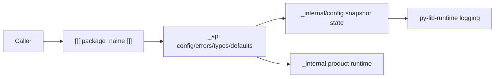

# System

## Overview

[[[ project_title ]]] starts with the common py library foundation: callers
import supported names from `[[[ package_name ]]]`; `_api/config.py` re-exports
the public config lifecycle; `_internal/config/` owns immutable config snapshots
and install/read state; shared runtime support comes from `py-lib-runtime`.

Question this diagram answers: What boundary does the package create?

## Runtime Shape

- The top-level package re-exports only supported public objects.
- `_api` owns public declarations and thin facades.
- `_api/config.py` stays a thin re-export facade.
- `_api/defaults.py` stores declarative built-in defaults as real fields are
  added.
- `_api/types.py` is the home for stable caller-facing vocabulary.
- `_internal/config/` owns config models, validation, default assembly, and
  process-wide snapshot state.
- Runtime modules import shared logging and preview helpers from
  `py-lib-runtime`.
- Product-specific runtime modules grow under `_internal`.
- `examples/` demonstrates public API flows, `tests/` prove behavior, and
  `workbench/` investigates manual questions without becoming production
  dependencies.

The baseline package exports `__version__`, `[[[ error_class_name ]]]`,
`InvalidConfigValueError`, `[[[ config_class_name ]]]`, `get_config`, and
`install_config`. Add product-specific public facades and DTOs as real library
behavior appears.

## Growth Rule

Architecture docs should follow product meaning, not folder structure. When the
first real behavior lands, name the durable concept under
`architecture/concepts/`, document any important lifecycle under
`architecture/flows/`, and mirror the same slice in verification docs and e2e
paths where applicable.
