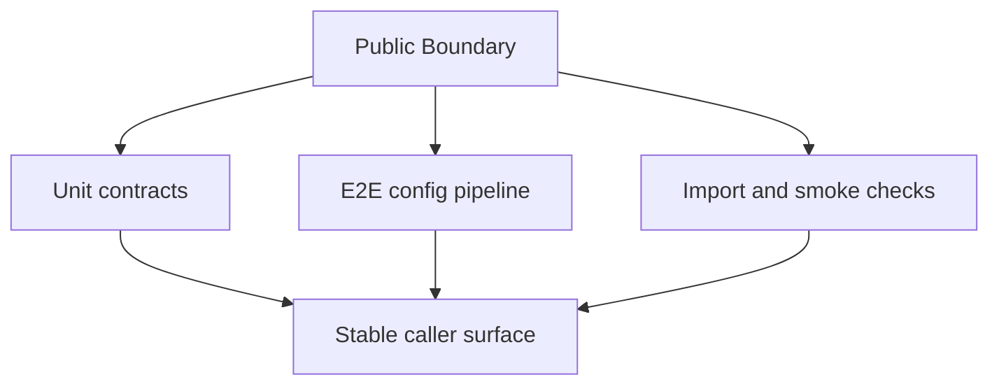

# Public Boundary And Errors

## Overview

This document describes how the baseline proves that the public package import
boundary, config lifecycle, public errors, and private implementation
boundaries remain usable.

Question this diagram answers: Which package-boundary guarantees are checked?

## Proof Areas

## 1. Proof: Public Config Boundary Stays Usable

This proof area shows that the baseline public names resolve through the
supported top-level package entrypoint and that config install/read state works
without importing private modules.

### Seen In Tests

[test_public_package.py](../../../tests/[[[ package_name ]]]/unit/test_public_package.py):
proves top-level exports resolve, public config names are available, the
package-specific public exception exists, and version metadata is available.

[test_public_config_pipeline.py](../../../tests/[[[ package_name ]]]/e2e/public_boundary/test_public_config_pipeline.py):
proves the config lifecycle works through its supported boundary.

Would fail if:

- top-level exports drifted away from the documented public surface
- the public exception stopped being available
- config install/read helpers stopped working through public imports
- distribution metadata could not be resolved

## 2. Proof: Import Direction Keeps Internals Private

This proof area shows that public, private, support, example, test, and
workbench code keep the intended dependency direction.

### Seen In Checks

`uv run lint-imports --config pyproject.toml`
proves package-boundary contracts declared in project configuration.

`uv run py-lib-smoke-public-api`
proves the top-level public export list is present, unique, and internally
consistent.

`uv run pytest tests/[[[ package_name ]]]/e2e/examples`
proves committed runnable examples still execute through public imports.

Would fail if:

- examples imported private modules or stopped running from the repository root
- tests started relying on private modules for public-contract proof
- public facades imported private implementation through unapproved paths
- top-level exports no longer matched the intended public surface
