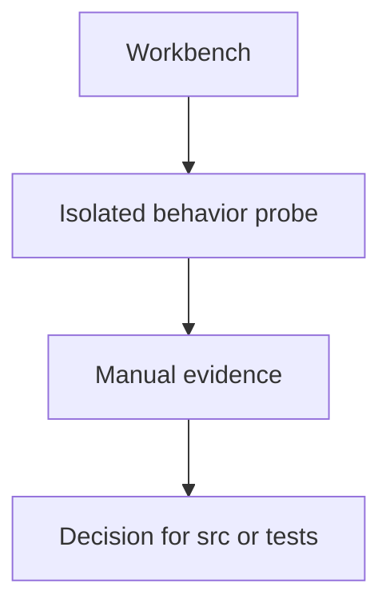

# Workbench Overview

## Overview

`workbench/` is for manual probes that investigate behavior outside shipped
package code and outside default pytest. Use `examples/` for canonical runnable
public API demos; use `workbench/` for questions that are still exploratory.
The baseline keeps the folder empty except for package markers.

Question this diagram answers: What validation role does workbench play?

## Rules

- Add a workbench module only for a real investigation or live dependency
  question.
- Keep workbench scripts direct-runnable with `python -m ...`.
- Move stable caller-facing demonstrations to `examples/`.
- Do not import workbench code from shipped package code.
- Do not treat manual workbench evidence as a replacement for committed tests.
